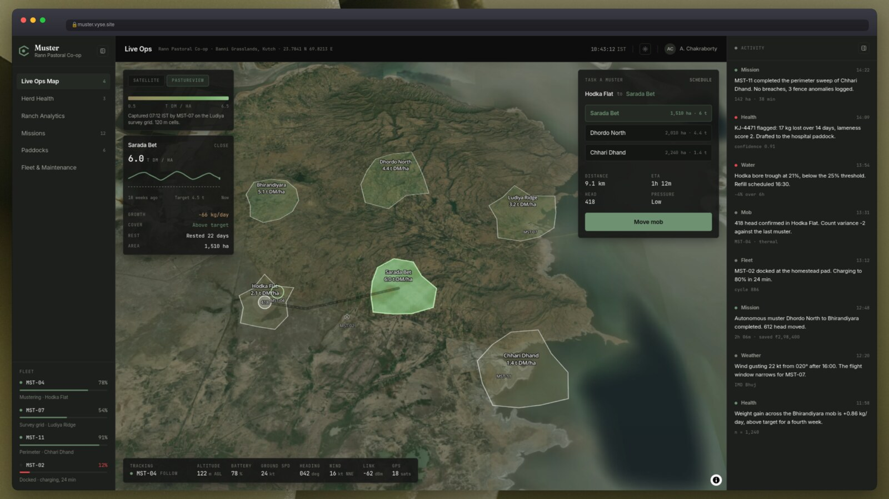

<div align="center">
  <h1>Muster</h1>

  <h3>An operations console for an autonomous drone fleet that musters cattle.</h3>

  <div align="center">
    <a href="https://muster.vyse.site">
      
    </a>
    
    
    
  </div>

  <br />

  <a href="https://muster.vyse.site">
    
  </a>
</div>

Press **Move mob** and watch a real muster run: 418 head follow their route across the Banni Grasslands while two aircraft work the mob. The camera follows the lead drone, the basemap switches to measured pasture cover, and you can open the aircraft's downward-facing camera without leaving the map.

## What this is

A build of [Brumby](https://brumby.com)'s product surface. Brumby flies drones that muster cattle, count head, measure pasture biomass and inspect water and fences. There is no drone here, so the console has to carry the whole product story by itself.

That makes it a **simulation, not a dashboard shell**. Nothing is a static mockup. The mob genuinely walks its route on a per frame tick, batteries genuinely drain, alerts genuinely fire at waypoints, and every instrument on screen reads from the same store. If two panels quote an altitude, they quote the same one, because they read the same function.

## Run it

Live at **[muster.vyse.site](https://muster.vyse.site)**, or locally on port `3001`:

```bash
pnpm install
pnpm dev:web
```

No keys needed: the map falls back to Esri World Imagery. Set `NEXT_PUBLIC_MAPBOX_TOKEN` in `apps/web/.env` to swap the basemap over to Mapbox satellite.

Open `/ops` and press **Move mob**. The run takes ~ninety seconds.

## Setting

[**Banni Grasslands, Kutch, Gujarat.**](https://en.wikipedia.org/wiki/Banni_Grasslands_Reserve) A real place: the largest grassland in Asia, worked by Maldhari pastoralists running Kankrej cattle and Banni buffalo on rotational grazing.

```
Operation   Rann Pastoral Co-operative, Banni
Centre      23.7841 N, 69.8213 E   IST   IMD Bhuj for weather
Paddocks    Bhirandiyara, Dhordo North, Hodka Flat,
            Ludiya Ridge, Sarada Bet, Chhari Dhand
Herd        2,270 head
Tags        INAPH 12 digit ear tags, IN 356 000 004471, shown as KJ-4471
Units       kg, hectares, mm, kt, m AGL
Currency    rupees with en-IN grouping, so 2,48,61,000 and not 24,861,000
Aircraft    MST-04 Baaz, MST-07 Saras, MST-11 Koel, MST-02 Cheel
```

Brumby's operational vocabulary stays as it is, so paddock, mob, muster, bore, head and draft are all used the way the product uses them. Everything else is local. One module, `lib/format.ts`, owns every unit and locale decision.

## Screens

| Screen                | Route        | What it answers                               |
| --------------------- | ------------ | --------------------------------------------- |
| Live Ops Map          | `/ops`       | Where is the mob, and what is the fleet doing |
| Herd Health           | `/herd`      | How do you know that animal is sick           |
| Ranch Analytics       | `/analytics` | What has this saved                           |
| Missions              | `/missions`  | What has been flown                           |
| Paddocks              | `/paddocks`  | What is the feed doing                        |
| Fleet and Maintenance | `/fleet`     | What is airworthy                             |

The first three are built deep. The last three carry real fixture data and are deliberately static (cuz i felt lazy).

## Stack

Next.js 16 and React 19 on Turbopack, Tailwind v4, shadcn on `@base-ui/react`, Zustand plus one rAF loop for the simulation, MapLibre GL for the map, Turf subpackages for the geo maths, `motion` and `@number-flow/react` for motion, Oxlint and Oxfmt.

## Layout

```
apps/web/src/
  app/(console)/     ops, herd, analytics, missions, paddocks, fleet
  components/        shell, map, herd, analytics, shared
  lib/
    format.ts        every unit and locale decision
    data/            Banni fixtures
    sim/             store, the rAF loop, route, the clip pool
    map/style.ts     sRGB map palette and satellite style
    chart/palette.ts validated status colours
packages/
  ui/                shared shadcn primitives and design tokens
  env/               typed environment schema
apps/web/public/pov/ six encoded down camera clips
```

Files stay under 300 to 500 lines. Past that they get split.

## Credits

Down camera footage from [Pexels](https://www.pexels.com), free for commercial use with no attribution required, graded and cut to match Banni. Satellite imagery from Esri World Imagery or Mapbox depending on configuration. [Brumby](https://brumby.com/) is a real company and this is an unaffiliated build of their product surface.
